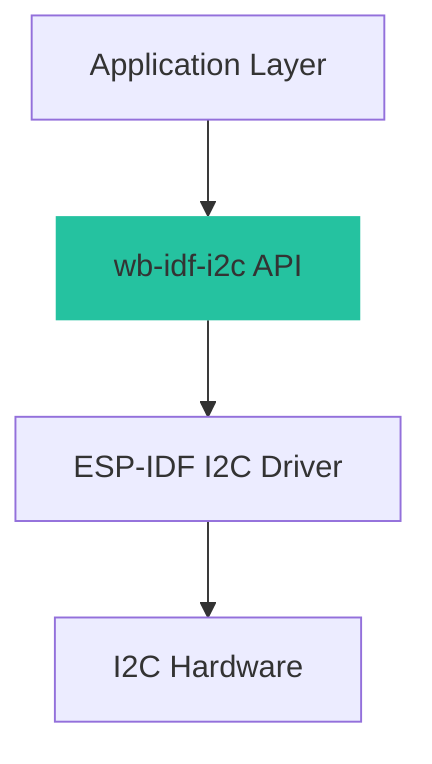
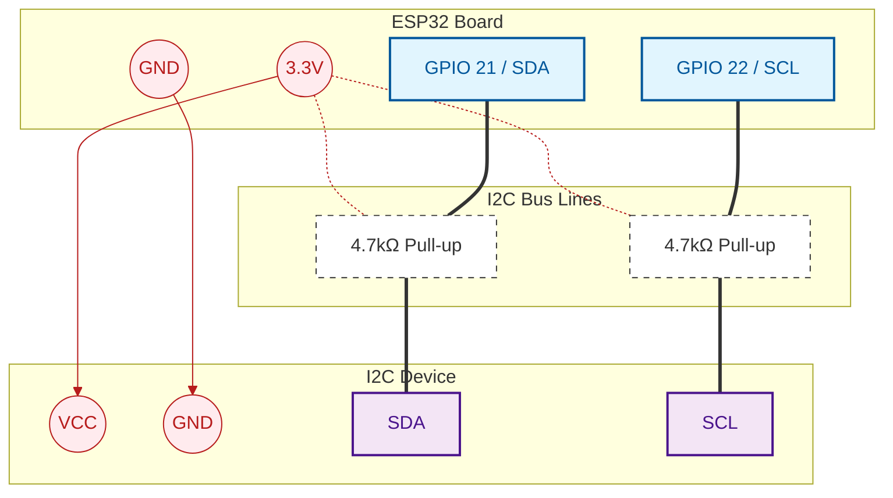

# I2C Master Driver

Advanced I2C Master functionality for ESP-IDF.

## Overview

The **I2C Master Driver** provides a comprehensive, high-level interface for I2C communication on ESP32 platforms. It extends the standard ESP-IDF I2C driver with additional convenience functions, better error handling, and multi-bus support.

This driver is designed for production use with focus on:


- Ease of Use : Simple, intuitive API
- Reliability : Comprehensive error checking
- Performance : Optimized for low latency
- Thread Safety : Safe for concurrent access

## Key Features

- ✅ Multi-Bus Support : Control multiple I2C buses (I2C_NUM_0, I2C_NUM_1)
- ✅ Device Management : Easy device handle creation and lifecycle management
- ✅ Device Probing : Automatic detection and validation of I2C devices
- ✅ Byte Operations : Single and multi-byte register read/write
- ✅ Bit Manipulation : Read and write individual bits or bit ranges
- ✅ Word Operations : Native 16-bit register access with endianness handling
- ✅ Error Handling : Detailed error codes and logging
- ✅ Thread-Safe : Internal mutex protection for concurrent access

## Architecture

The driver follows a layered architecture:



## API Modules

The API is organized into functional modules for better clarity:

### @ref wb_idf_i2c_init "Initialization & Management"

Core functions for setting up I2C buses and managing device handles:


- Bus initialization with configurable GPIO pins
- Device handle creation and deletion
- Device probing and detection

Key functions:


- wb_i2c_master_bus_init() - Initialize an I2C bus
- wb_i2c_master_device_create() - Create a device handle
- wb_i2c_master_bus_probe_device() - Check if device responds

### @ref wb_idf_i2c_byte "Byte Operations"

Standard byte-level I/O operations for register access:


- Single byte read/write
- Multi-byte burst transfers

Key functions:


- wb_i2c_master_bus_read_byte() - Read a single byte
- wb_i2c_master_bus_write_byte() - Write a single byte
- wb_i2c_master_bus_read_multiple_bytes() - Burst read
- wb_i2c_master_bus_write_multiple_bytes() - Burst write

### @ref wb_idf_i2c_bit "Bit Operations"

Fine-grained control for bit-level register manipulation:


- Read/write individual bits
- Read/write bit ranges (bit fields)
- Atomic read-modify-write operations

Key functions:


- wb_i2c_master_bus_read_byte_bit() - Read single bit
- wb_i2c_master_bus_write_byte_bit() - Write single bit
- wb_i2c_master_bus_read_byte_bits() - Read bit range
- wb_i2c_master_bus_write_byte_bits() - Write bit range

### @ref wb_idf_i2c_word "Word Operations (16-bit)"

16-bit register access for devices with multi-byte values:


- Read/write 16-bit words
- Bit operations on word registers
- Automatic byte order handling

Key functions:


- wb_i2c_master_bus_read_word() - Read 16-bit word
- wb_i2c_master_bus_write_word() - Write 16-bit word
- wb_i2c_master_bus_read_word_bit() - Read bit from word
- wb_i2c_master_bus_write_word_bit() - Write bit to word

## Quick Start Guide

### Installation

**Option 1: Component Manager (Recommended)**

Add to your project's `idf_component.yml` :

```c
dependencies:
  whirlingbits/wb-idf-i2c:
    version: "^1.0.0"
```

**Option 2: Git Submodule**

```c
cd components
git submodule add https://github.com/WhirlingBits/wb-idf-core.git
```

**Option 3: Manual Copy**

Copy the `wb-idf-i2c` folder to your project's `components/` directory.

### Basic Usage Example

```c
#include "wb-idf-i2c.h"

// 1. Initialize the I2C bus
i2c_master_bus_handle_t bus_handle;
esp_err_t ret = wb_i2c_master_bus_init(
    I2C_NUM_0,        // I2C port
    GPIO_NUM_22,      // SCL pin
    GPIO_NUM_21       // SDA pin
);

if (ret != ESP_OK) {
    ESP_LOGE(TAG, "I2C bus init failed: %s", esp_err_to_name(ret));
    return;
}

// 2. Create a device handle (e.g., for EEPROM at address 0x50)
i2c_master_dev_handle_t eeprom_dev = wb_i2c_master_device_create(
    bus_handle,
    0x50,         // Device address (7-bit)
    100000        // Clock speed (100kHz)
);

// 3. Check if device is present
ret = wb_i2c_master_bus_probe_device(bus_handle, 0x50, 1000);
if (ret == ESP_OK) {
    ESP_LOGI(TAG, "Device found at 0x50");
}

// 4. Write a byte
uint8_t data = 0xAB;
ret = wb_i2c_master_bus_write_byte(eeprom_dev, 0x00, data);

// 5. Read a byte
uint8_t read_data;
ret = wb_i2c_master_bus_read_byte(eeprom_dev, 0x00, &read_data);
ESP_LOGI(TAG, "Read: 0x%02X", read_data);

// 6. Cleanup
wb_i2c_master_device_delete(eeprom_dev);
wb_i2c_master_bus_delete(bus_handle);
```

## Hardware Configuration

### Typical Wiring



**Pull-up Resistor Guidelines:**

| Bus Speed | Cable Length | Recommended Pull-up |
|---|---|---|
| 100 kHz | < 3 meters | 4.7 kΩ |
| 400 kHz | < 1 meter | 2.2 kΩ |
| 1 MHz | < 30 cm | 1.0 kΩ |

### GPIO Selection

**ESP32 I2C-capable GPIO pins:**

- Any GPIO can be used for I2C (software flexibility)
- Commonly used: GPIO21 (SDA), GPIO22 (SCL)
- Avoid strapping pins (GPIO0, GPIO2, GPIO12, GPIO15)
- Use input-only pins with external pull-ups

### Timing Specifications

| Mode | Clock Freq | Max Distance | Rise Time |
|---|---|---|---|
| Standard | 100 kHz | ~3 meters | < 1000 ns |
| Fast Mode | 400 kHz | ~1 meter | < 300 ns |
| Fast Mode Plus | 1 MHz | < 30 cm | < 120 ns |

## Usage Examples

Complete, runnable examples are available in the `examples/` directory:

### I2C Bus Scanner

Scans all I2C addresses (0x00-0x7F) to detect connected devices:

```c
// examples/i2c_scanner/main.c

for (uint8_t addr = 0x00; addr < 0x80; addr++) {
    esp_err_t ret = wb_i2c_master_bus_probe_device(bus_handle, addr, 100);
    if (ret == ESP_OK) {
        printf("Device found at address 0x%02X\n", addr);
    }
}
```

### EEPROM Read/Write

Reading and writing to an AT24C32 EEPROM:

```c
// examples/eeprom_readwrite/main.c

// Write data
uint8_t write_data[] = "Hello I2C!";
wb_i2c_master_bus_write_multiple_bytes(dev, 0x00, write_data, sizeof(write_data));

// Read back
uint8_t read_data[32];
wb_i2c_master_bus_read_multiple_bytes(dev, 0x00, read_data, sizeof(write_data));
printf("Read: %s\n", read_data);
```

### Sensor Polling (MPU6050)

Continuously reading accelerometer data:

```c
// examples/mpu6050_read/main.c

while (1) {
    uint8_t accel_data[6];
    wb_i2c_master_bus_read_multiple_bytes(dev, 0x3B, accel_data, 6);
    
    int16_t accel_x = (accel_data[0] << 8) | accel_data[1];
    int16_t accel_y = (accel_data[2] << 8) | accel_data[3];
    int16_t accel_z = (accel_data[4] << 8) | accel_data[5];
    
    printf("Accel: X=%d Y=%d Z=%d\n", accel_x, accel_y, accel_z);
    vTaskDelay(pdMS_TO_TICKS(100));
}
```

## Performance Considerations

### Latency Measurements

Typical operation latencies on ESP32 @ 240MHz:

| Operation | @ 100kHz | @ 400kHz | @ 1MHz |
|---|---|---|---|
| Single byte read | ~250 µs | ~70 µs | ~35 µs |
| Single byte write | ~250 µs | ~70 µs | ~35 µs |
| 16-byte burst read | ~1.5 ms | ~400 µs | ~200 µs |
| Bit read (RMW) | ~500 µs | ~140 µs | ~70 µs |

### Optimization Tips

- Use burst operations (read/write_multiple_bytes)
- Increase clock speed to 400 kHz or 1 MHz
- Minimize number of transactions

- Use 100 kHz standard mode
- Batch operations to reduce bus activity
- Put I2C devices in sleep mode when idle

- Add external pull-up resistors (4.7 kΩ typical)
- Keep cables short (< 30 cm for high speeds)
- Shield cables in noisy environments
- Add series resistors (100Ω) for ESD protection

## Troubleshooting

### Common Error Codes

**ESP_ERR_TIMEOUT**

Device not responding on the bus.

- Wrong device address (check datasheet for 7-bit vs 8-bit address)
- Missing or insufficient pull-up resistors
- Device not powered
- Wiring error (SDA/SCL swapped)
- Bus speed too high for cable length

- Verify device address with I2C scanner
- Check voltage on SDA/SCL (should be 3.3V when idle)
- Add 4.7kΩ pull-ups if not present
- Reduce bus speed to 100 kHz for testing

**ESP_FAIL (NACK received)**

Device acknowledged address but NACK'd the data.

- Invalid register address
- Write to read-only register
- Device not initialized
- Device in wrong mode

- Check register address in device datasheet
- Verify device initialization sequence
- Read device status register

**ESP_ERR_INVALID_STATE**

I2C bus or device not properly initialized.

- Call wb_i2c_master_bus_init() before using bus
- Ensure device handle is created before use
- Check return values of initialization functions

### Debug Techniques

**Enable Debug Logging:**

```c
esp_log_level_set("i2c", ESP_LOG_DEBUG);
esp_log_level_set("wb_i2c", ESP_LOG_DEBUG);
```

**Use I2C Scanner:**

Run the included `i2c_scanner` example to detect all devices:

```c
cd examples/i2c_scanner
idf.py build flash monitor
```

- START condition present
- Correct address sent (7-bit + R/W bit)
- ACK/NACK signals correct
- STOP condition present
- Clock stretching (if device supports it)
- Data setup and hold times

### Bus Recovery

If the bus is stuck (SDA or SCL held low):

```c
// 1. Power cycle the I2C device (if possible)

// 2. Send clock pulses to release SDA
gpio_set_direction(GPIO_NUM_22, GPIO_MODE_OUTPUT);
gpio_set_level(GPIO_NUM_21, 1); // SDA high

for (int i = 0; i < 9; i++) {
    gpio_set_level(GPIO_NUM_22, 0);
    vTaskDelay(1);
    gpio_set_level(GPIO_NUM_22, 1);
    vTaskDelay(1);
}

// 3. Re-initialize I2C bus
wb_i2c_master_bus_delete(bus_handle);
wb_i2c_master_bus_init(I2C_NUM_0, GPIO_NUM_22, GPIO_NUM_21);
```

## Best Practices

### Error Handling

Always check return values:

```c
esp_err_t ret = wb_i2c_master_bus_write_byte(dev, 0x10, 0xFF);
if (ret != ESP_OK) {
    ESP_LOGE(TAG, "Write failed: %s", esp_err_to_name(ret));
    // Handle error (retry, reset device, notify user, etc.)
}
```

### Thread Safety

The driver uses internal mutexes for thread safety. Multiple tasks can safely access the same I2C bus concurrently:

```c
// Task 1
void sensor1_task(void *arg) {
    while (1) {
        wb_i2c_master_bus_read_byte(dev1, 0x00, &data);
        vTaskDelay(100);
    }
}

// Task 2 - safe to run concurrently
void sensor2_task(void *arg) {
    while (1) {
        wb_i2c_master_bus_read_byte(dev2, 0x00, &data);
        vTaskDelay(100);
    }
}
```

### Resource Management

Always clean up resources:

```c
// Create resources
wb_i2c_master_bus_init(...);
dev_handle = wb_i2c_master_device_create(...);

// Use resources...

// Clean up before exit
wb_i2c_master_device_delete(dev_handle);
wb_i2c_master_bus_delete(bus_handle);
```

## Testing

The component includes comprehensive unit tests and integration tests.

**Run Unit Tests:**

```c
cd test/wb_idf_i2c_test
idf.py build flash monitor
```

- Bus initialization with various configurations
- Device creation and deletion
- All byte, bit, and word operations
- Error conditions and recovery
- Multi-threaded access

## Complete API Reference

For detailed function documentation, see:


- Initialization & Management
- Byte Operations
- Bit Operations
- Word Operations (16-bit)

## Changelog

- Initial release
- Full I2C master functionality
- Byte, bit, and word operations
- Comprehensive documentation and examples

## License

Copyright (c) 2024 WhirlingBits

Licensed under the Apache License, Version 2.0 (the "License"); you may not use this file except in compliance with the License. You may obtain a copy of the License at


```
http://www.apache.org/licenses/LICENSE-2.0

```


Unless required by applicable law or agreed to in writing, software distributed under the License is distributed on an "AS IS" BASIS, WITHOUT WARRANTIES OR CONDITIONS OF ANY KIND, either express or implied. See the License for the specific language governing permissions and limitations under the License.

## Support & Contributing

- GitHub Issues
- Discussions
- Email: support@whirlingbits.com

- Pull requests are welcome!
- See CONTRIBUTING.md for guidelines
- Follow ESP-IDF coding standards
- Add tests for new features

- WhirlingBits Team
- https://whirlingbits.com

## Sub-Modules

- [Initialization & Management](./wb_idf_i2c_init)
