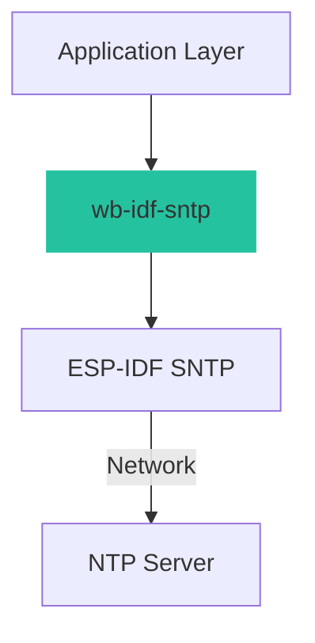

# SNTP Client

Simple SNTP Time Synchronization for ESP-IDF.

## Overview

The **SNTP Client** module simplifies time synchronization using the Simple Network Time Protocol (SNTP). It provides a streamlined interface to initialize the SNTP service, wait for synchronization, and handle timezones, wrapping the standard ESP-IDF SNTP functionality.

This driver is designed for:


- Simplicity : Minimal setup required
- Reliability : Handles waiting for time sync automatically
- Convenience : Easy timezone configuration

## Key Features

- ✅ One-Line Initialization : Quick setup of SNTP service
- ✅ Blocking Sync : Logic to wait until time is actually valid
- ✅ Timezone Management : String-based timezone configuration (POSIX format)
- ✅ Standard struct tm : Uses standard C time structures

## Architecture

The module acts as a high-level wrapper around the ESP-IDF SNTP component:



## API Modules

### [Initialization & Management](wb_idf_sntp_init)

Core functions for setting up and retrieving time:

Key functions:


- initialize_sntp() - Initialize SNTP service and configure servers
- obtain_time() - Blocking wait for synchronization and retrieve current local time

## Quick Start Guide

### Installation

Ensure `wb-idf-core` is included in your project components.

### Basic Usage Example

```c
#include "wb-idf-sntp.h"
#include "esp_wifi.h" 

void app_main(void)
{
    // 1. Ensure WiFi is connected first!
    // ... setup_wifi() ...

    // 2. Initialize SNTP
    initialize_sntp();

    // 3. Get the time (this blocks until time is synced)
    struct tm timeinfo;
    // Example: Central European Time (CET)
    char *timezone = "CET-1CEST,M3.5.0,M10.5.0/3"; 
    
    obtain_time(&timeinfo, timezone);

    // 4. Use the time
    char strftime_buf[64];
    strftime(strftime_buf, sizeof(strftime_buf), "%c", &timeinfo);
    ESP_LOGI("SNTP", "The current date/time is: %s", strftime_buf);
}
```

## Troubleshooting

### Common Issues

**Time sync never completes**

The `obtain_time` function loops until time is assumed to be set (usually when year > 1970).

- WiFi not connected or internet access blocked.
- NTP server blocked by firewall.
- DNS resolution failure for NTP server pool.

- Verify WiFi connection status before calling obtain_time .
- check logs for SNTP errors.

**Wrong Timezone**

- Incorrect POSIX timezone string.

- Check POSIX Timezone format .
- Common strings:
- UTC: "UTC0"
- CET/CEST: "CET-1CEST,M3.5.0,M10.5.0/3"
- EST/EDT: "EST5EDT,M3.2.0,M11.1.0"

## Best Practices

### Network Connectivity

Always ensure network connectivity (WiFi/Ethernet) is established before attempting to obtain time. While `initialize_sntp()` can be called early, `obtain_time()` requires an active connection to succeed.

### Task Blocking

Since `obtain_time` can be blocking (waiting for sync), avoid calling it from time-critical loops or high-priority tasks if sync has not been established yet.

## License

Copyright (c) 2024 WhirlingBits

Licensed under the Apache License, Version 2.0 (the "License"); you may not use this file except in compliance with the License. You may obtain a copy of the License at


```
[http://www.apache.org/licenses/LICENSE-2.0](http://www.apache.org/licenses/LICENSE-2.0)

```


Unless required by applicable law or agreed to in writing, software distributed under the License is distributed on an "AS IS" BASIS, WITHOUT WARRANTIES OR CONDITIONS OF ANY KIND, either express or implied. See the License for the specific language governing permissions and limitations under the License.

## Support & Contributing

- GitHub Issues

- WhirlingBits Team
