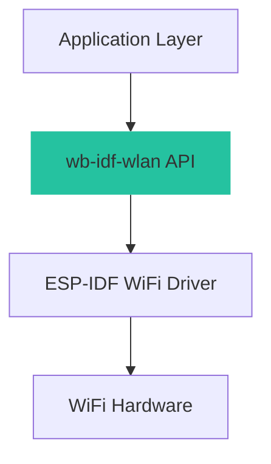

# WLAN Driver

Advanced WLAN functionality for ESP-IDF.

Functions for WLAN initialization and management.

## Overview

The **WLAN Driver** provides a simplified, high-level interface for WiFi connectivity on ESP32 platforms. It wraps the standard ESP-IDF WiFi driver to provide easy-to-use functions for common modes like Station (STA) and Access Point (AP).

This driver is designed for:


- Simplicity : One-function initialization for STA and AP modes
- Reliability : Built-in event handling and retry logic
- Convenience : Abstracts complex event loops and state machines

## Key Features

- ✅ Station Mode (STA) : Connect to existing WiFi networks
- ✅ Access Point Mode (AP) : Create a WiFi hotspot
- ✅ Security : Supports WPA/WPA2/WPA3 authentication (via Kconfig)
- ✅ Status Monitoring : Simple mechanism to check connection status
- ✅ Event Handling : Integrated event group management for connection states

## Architecture

The driver follows a layered architecture:



## API Modules

The API is organized into main functional areas:

### [Initialization](wb_idf_wlan_init)

Functions for setting up WiFi in different modes:


- Station Mode : Connect to a router
- Access Point Mode : Host a network

Key functions:


- wb_wifi_init_sta() - Initialize as Station (Client)
- wb_wifi_init_ap() - Initialize as Access Point (Hotspot)

### [Management](wb_idf_wlan_mgmt)

Functions for controlling the WiFi lifecycle:

Key functions:


- wb_wifi_check_status() - Get current connection status
- wb_wifi_deinit() - Stop WiFi and free resources

## Quick Start Guide

### Installation

Ensure `wb-idf-core` is included in your project components.

### Station Mode Example

Connecting to a WiFi network:

```c
#include "wb-idf-wlan.h"
#include "nvs_flash.h"

void app_main(void)
{
    // 1. Initialize NVS (Required for WiFi)
    esp_err_t ret = nvs_flash_init();
    if (ret == ESP_ERR_NVS_NO_FREE_PAGES || ret == ESP_ERR_NVS_NEW_VERSION_FOUND) {
      ESP_ERROR_CHECK(nvs_flash_erase());
      ret = nvs_flash_init();
    }
    ESP_ERROR_CHECK(ret);

    // 2. Initialize WiFi in Station Mode
    char *ssid = "MyWiFiNetwork";
    char *password = "mysupersecretpassword";
    
    ESP_LOGI("WLAN", "Connecting to %s...", ssid);
    wb_wifi_init_sta(ssid, password);

    // 3. Check status (Optional)
    if (wb_wifi_check_status() == WIFI_CONNECTED_BIT) {
        ESP_LOGI("WLAN", "Connected successfully!");
    }
}
```

### Access Point Mode Example

Creating a WiFi hotspot:

```c
#include "wb-idf-wlan.h"
#include "nvs_flash.h"

void app_main(void)
{
    // NVS Init...
    
    // Initialize WiFi in AP Mode
    char *ap_ssid = "MyESP32Hotspot";
    char *ap_password = "password123";
    
    ESP_LOGI("WLAN", "Starting AP: %s", ap_ssid);
    wb_wifi_init_ap(ap_ssid, ap_password);
}
```

## Troubleshooting

### Common Issues

**Connection Failed**

The device attempts to connect but eventually fails or times out.

- Incorrect SSID or Password.
- Signal too weak.
- Router authentication settings mismatch (e.g., WPA3 required but not enabled in Kconfig).

- Double check credentials.
- Move closer to the router.
- Check menuconfig settings under Component config -> Wi-Fi .

**WiFi Init Failed**

- NVS not initialized before WiFi.
- Power supply insufficiency.

- Ensure nvs_flash_init() is called first.
- Check power supply stability.

## Best Practices

### NVS Initialization

Always initialize NVS Flash ( `nvs_flash_init()` ) before initializing WiFi, as the WiFi driver stores calibration data in NVS.

### Event Handling

The driver uses an internal Event Group. The `wb_wifi_check_status()` function can be used to poll the status, but for more complex applications, consider hooking into the standard ESP-IDF event loop if you need asynchronous notifications.

## License

Copyright (c) 2024 WhirlingBits

Licensed under the Apache License, Version 2.0 (the "License"); you may not use this file except in compliance with the License. You may obtain a copy of the License at


```
[http://www.apache.org/licenses/LICENSE-2.0](http://www.apache.org/licenses/LICENSE-2.0)

```


Unless required by applicable law or agreed to in writing, software distributed under the License is distributed on an "AS IS" BASIS, WITHOUT WARRANTIES OR CONDITIONS OF ANY KIND, either express or implied. See the License for the specific language governing permissions and limitations under the License.

## Support & Contributing

- GitHub Issues

- WhirlingBits Team

## Macros

### `WB_STATION_ESP_MAXIMUM_RETRY CONFIG_STATION_ESP_MAXIMUM_RETRY`

Initialize WiFi station mode with SSID and password.

### `WB_AP_ESP_WIFI_CHANNEL CONFIG_AP_ESP_WIFI_CHANNEL`

Initialize WiFi station mode with SSID and password.

### `WB_AP_MAX_STA_CONN CONFIG_AP_ESP_MAX_STA_CONN`

Initialize WiFi station mode with SSID and password.

### `WIFI_CONNECTED_BIT BIT0`

Initialize WiFi station mode with SSID and password.

### `WIFI_FAIL_BIT BIT1`

Initialize WiFi station mode with SSID and password.

## Functions

### wb_wifi_init_sta

Initialize WiFi station mode with SSID and password.

```c
void wb_wifi_init_sta(char *sta_ssid, char *sta_password)
```

**Parameters:**

- **sta_ssid** (`char *`): Pointer to null-terminated string containing the SSID of the WiFi network to connect to
- **sta_password** (`char *`): Pointer to null-terminated string containing the password for the WiFi network

**Returns:**

void

Initializes the WiFi interface in station (client) mode and connects to the specified WiFi network using the provided SSID and password.

**Note:** Ensure that WiFi is initialized before calling this function
 

**Note:** The SSID and password strings must remain valid during the function execution

---

### wb_wifi_init_ap

Initialize WiFi in Access Point (AP) mode.

```c
void wb_wifi_init_ap(char *ap_ssid, char *ap_password)
```

**Parameters:**

- **ap_ssid** (`char *`): Pointer to the SSID string for the Access Point. Must be a null-terminated string.
- **ap_password** (`char *`): Pointer to the password string for the Access Point. Must be a null-terminated string.

**Returns:**

void

Configures the WiFi module to operate as an Access Point, allowing other devices to connect to it using the provided SSID and password.

**Note:** Ensure that the WiFi module is properly initialized before calling this function.
 

**Note:** The SSID and password strings must remain valid until the function returns.

---

### wb_wifi_deinit

Deinitialize WiFi.

```c
void wb_wifi_deinit(void)
```

**Parameters:**

- **** (`void`)

**Returns:**

void

Deinitializes the WiFi interface, releasing any resources and stopping any ongoing WiFi operations.

---

### wb_wifi_check_status

Check WiFi connection status.

```c
int wb_wifi_check_status()
```

**Returns:**

int Status code representing the WiFi connection state

Returns the current status of the WiFi connection.

---
